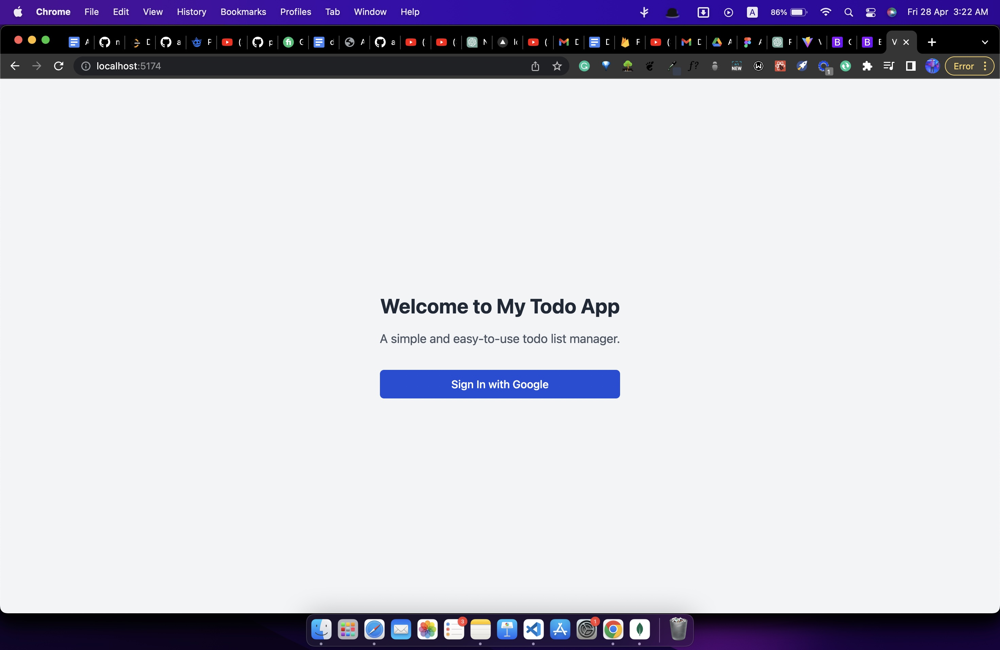
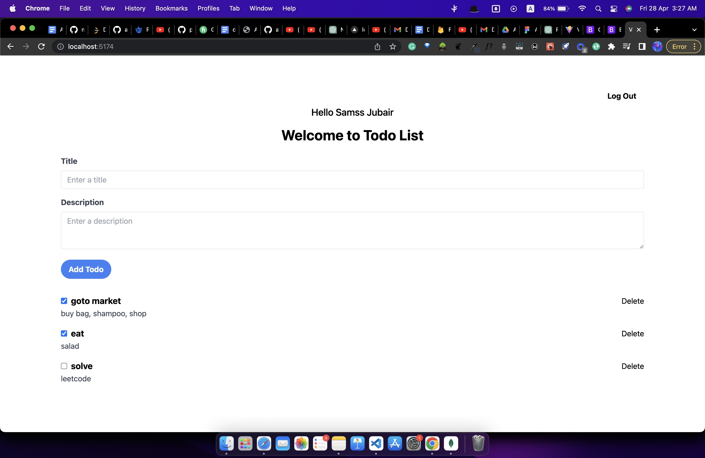

# (TODO LIST)
## Ray Digital Full Stack Assignment 

Things that needs to be installed in your computer
1. Nodejs
1. MongoDB
1. Github
1. VS Code(or any other code editor)

To run the project
1. Clone the repository
1. Open the folder in VS Code

To run the backend
1. Open the terminal
1. Go to the backend folder
1. Run the command `npm install`
1. Run the command `npm start` or run `nodemon index.js`

To run the frontend
1. Open the terminal
1. Go to the frontend folder
1. Run the command `npm install`
1. Run the command `npm run dev`

## screenshots

### login page

### home page

